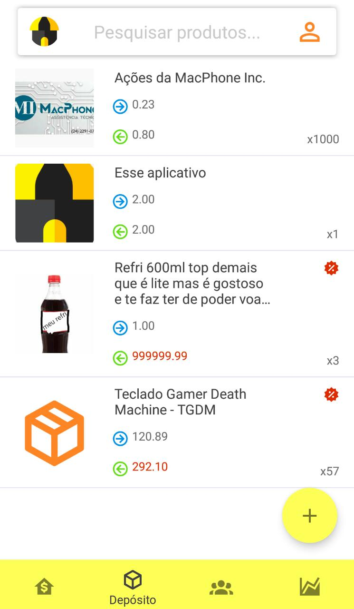
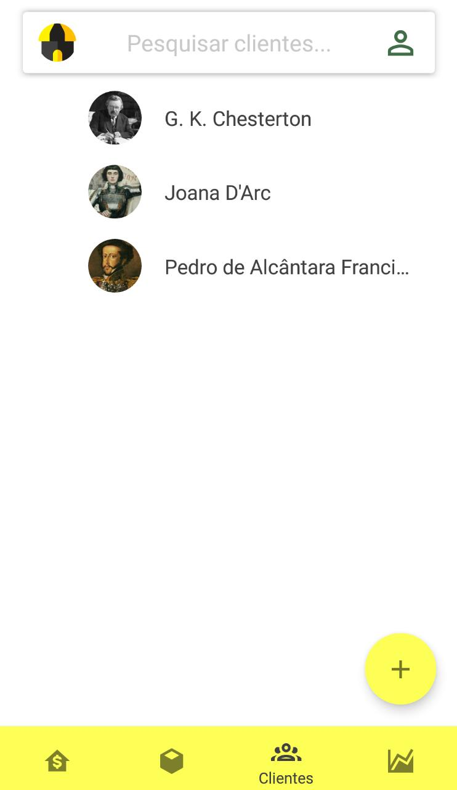
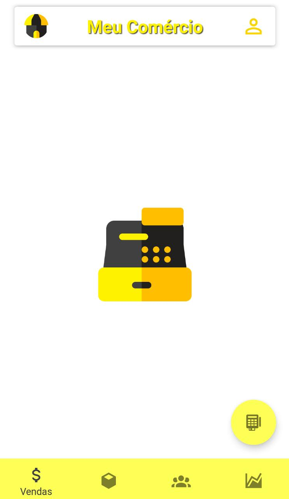
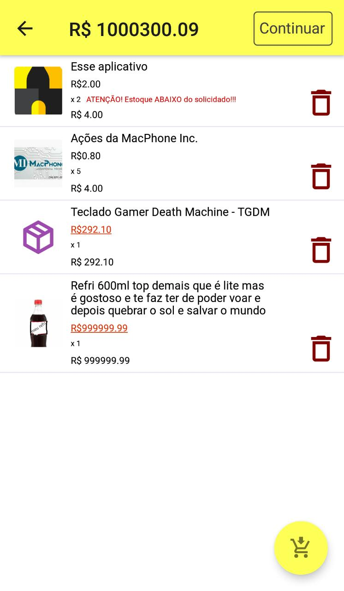
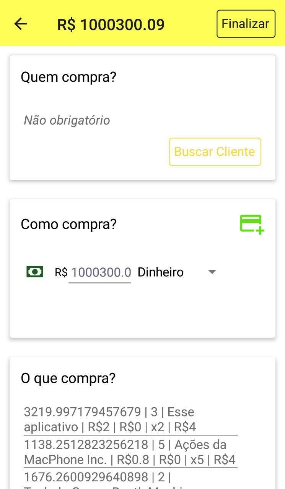

<p align="center">
  
</p>
<h1 align="center">Meu Comercio</h1> 
<p align="center">
Terminal de supermercado + Gerenciador de estoque + Gerenciador de clientes + Estatísticas RELEVANTES + Portabilidade de um aplicativo
<br/> = Meu Comércio
</p>
<h4 align="center"> 
	🚧 Meu Comercio🏪 em construção... 🚧 <small>rev:02/09/20</small><br/>
	👌 Mobile v1.0 👌 <small>02/09/20</small><br/>
	🚧 Server v1.0 em construção... 🚧 <br/>
</h4>

<p align="center">

</p>

<br/>

<h3 align="center">
  <a href="#layout">Layout</a> •
  <a href="#tecnologias">Tecnologias</a> •
  <a href="#como-executar">Como executar o projeto</a> • 
  <a href="#roadmap">Roadmap</a> • 
  <a href="#como-contribuir">Como Contribuir</a> • 
  <a href="#autor">Autor</a>
</h3>

<h2 id="Layout">🎨 Layout</h2>

<p align="center">
  
  
  
  
  
  
</p>

<h2 id="tecnologias">🛠 Tecnologias</h2>

As seguintes ferramentas foram usadas na construção do projeto:

- [Expo][expo]
- [Node.js][nodejs]
- [React Native][rn]

<h2 id="como-executar">🚀 Como executar o projeto</h2>

Podemos considerar este projeto como sendo divido em duas partes:

1. Back End (pasta server) 🚧 Em construção... 🚧
2. Mobile (pasta mobile)

💡No entanto, atualmente, o Backend não está sendo usado pelo Mobile, o que nos deixa apenas com uma parte para execução do projeto.

<h3 id="pre-requisitos">Pré-requisitos</h3>

<P>Antes de começar, você vai precisar ter instalado em sua máquina as seguintes ferramentas:
[Git](https://git-scm.com), [React Native][rn].
Além disto é bom ter um editor para trabalhar com o código como [VSCode][vscode].
Como o projeto foi feito com expo, você precisa baixar o aplicativo EXPO na sua loja oficial:<p>

•<a href="https://play.google.com/store/apps/details?id=host.exp.exponent&hl=pt_BR"> Play Store</a><br/>
•<a href="https://apps.apple.com/br/app/expo-client/id982107779"> App Store</a>

<h3 id="como-executar-backend">🎲 Rodando o Back End (servidor)</h3>

🚧 Em construção... 🚧

<h3 id="como-executar-mobile">📱Rodando a aplicação mobile </h3>

```bash
# Clone este repositório
$ git clone https://github.com/giovanecf/meu-comercio.git

# Acesse a pasta do projeto no seu terminal/cmd
$ cd meu-comercio

# Vá para a pasta da aplicação Mobile
$ cd mobile

# Instale o expo
$ npm install expo-cli --global

# Instale as dependências
$ npm install

# Execute a aplicação em modo de desenvolvimento
$ expo start

# ...Ou
$ npm start

```

Ao subir o live server do expo, acesse o aplicativo em seu dispositivo, e adicione a rota no Meu Comercio, scanneando o QR Code que te é apresentado no terminal ou na página que se abrirá em seu navegador.

<h2 id="roadmap">🛣️ Roadmap</h2>

<h3>Mobile v1️</h3>

<h4>Bugs</h4>

- [x] Botão Continuar da new_sale habilidato mesmo sem produtos
- [x] Hero Img da new_sale não está centralizado
- [x] Listagem em new_sale com bug dos produtos
- [x] Botão Finalizar da finish_sale então com o comportamento da new_sale
- [x] Header Principal, errada
- [x] Formato de thumbnail de produtos não estão no padrão, ou seja, quadrado
- [x] Na listagem de produtos na products e na listagem de clientes na clients,
      as Views não estão responsivas.
- [x] Em products e provavelmente em clients, a descrição está saindo da tela, se for muito grande
- [x] Estilo não responsivo entre itens com ou sem foto
- [x] Ao editar cliente ou produto, a thumbnail não aparece
- [x] Quando sem endereço, mostra apenas virgulas em client_details
- [x] Na iteração do endereço, há situações onde o endereço volta bugado
- [x] Não sai da tela de camera quando pressiona o botão de voltar
- [x] Estoque em products mostra > x100, bugado
- [x] Ao adicionar mais do que tem no estoque, unitáriamente, não tem o aviso
- [x] Em ItemProductList, os textos de preço não estão verticalmente centralizados.
- [x] O header de payment_sale não tem elevation

<h4>Ajustes</h4>

- [x] Diminuir 2px em todos os sizes em products.
- [x] Diminuir em 2px o todos os sizes da barra de navegação
- [x] Trocar o campo de desconto e o de estoque de lugar

<h4>Implementação</h4>

- [x] TextInput com nome do campo, movido pra cima da "label", como no google contatos (Floating Text)
- [x] Criar footer com padding no fim da lista em products e clients
- [x] Criar elevação na header, ai rolar pra baixo em new products, new client, product details e client details
- [x] Mudar a hero image de Stats
- [x] Mudar a hero image de Sale
- [x] Implementar banco de dados
- [x] Botão Excluir de product_details e client_details não tem funcionalida
- [x] Botão Salvar de new_product e new_client não tem funcionalida
- [x] Inserir foto por câmera e galeria em new_product e new_client
- [x] Criar alerta de descarte de informação na criação de produtos e clientes
- [x] Mudar a hero image de clients
- [x] Mudar a hero image de products
- [x] Campo de pesquisa nas abas de products e clients
- [x] Colocar vizualizador de Imagem no client_details e product_details
- [x] Adicionar estoque disponível na view de procura em new_sale
- [x] Adicionar aviso de estoque abaixo do solicitado em new_sale
- [x] Checar CPF. Avisar se já houver um igual.
- [x] Criar não obrigatoriedade do cliente em uma venda
- [x] Em new_sale, ao adicionar um item já presente, adicionar no mesmo item

<h3>Mobile v2<h3>

<h4>Bugs</h4>

<p>Nada.... Ainda</p>

<h4>Ajustes</h4>

- [ ] IMPORTANT! Mudar tipo id de int para text

<h4>Impletações</h4>

- [ ] IMPORTANT! Aplicação com modo de serviço
- [ ] Ao cliqcar no telefone, ser direcionado para tela de discagem.
- [ ] Dese-se tornar o texto de telefone, com aspecto de Button.
- [ ] Criar cliente no momento da compra
- [ ] Colocar aviso de sellPrice abaixo de costPrice e discountabaixo de sellPrice-costPrice
- [ ] Algum sistema simples de notificação, com aquele ponto vermelho
- [ ] Navegação swipe, nas telas de tab
- [ ] 3 listas horizontais das vendas feitas:
      _ No dia
      _ No mês \* Era uma vez...(Antes de um mês)
- [ ] Lista de Cards, cada um com um assunto:
      _ TicketMédio
      _ Faturamento médio diário do mês
      _ Faturamento médio mensal doano
      _ Lucro médio diário do mês
      _ Lucro médio mensal do ano
      _ Top 5: Produtos mais vendidos \* Top 5: Niguém quer (Produtos menos vendidos)

- [ ] Compras do cliente na client_details
- [ ] Vizualizador de cod_barras em products
- [ ] Ao clicar no telefone, ser direcionado para tela de discagem.
- [ ] Deve-se tornar a texto de telefone, com aspecto de Button
- [ ] Mostrar lucro em cada item, em ItemListProduct
- [ ] Implentar card de desconto na venda total em payment_sale
- [ ] Criar categoria de serviços, com Orçamento e data de enterga

<h3>Server v1️ 🚧 Em construção 🚧</h3>

<h4>Bugs</h4>

<p>Nada.... Ainda</p>

<h4>Ajustes</h4>

<p>-/-</p>

<h4>Implementação</h4>

- [ ] Criar rotas RESTFull
- [ ] Criar banco de dados
- [ ] Publicar no [Heroku][heroku]

<h2 id="como-contribuir">😯 Como contribuir para o projeto</h2>

1. Faça um **fork** do projeto.
2. Crie uma nova branch com as suas alterações: `git checkout -b my-feature`
3. Salve as alterações e crie uma mensagem de commit contando o que você fez: `git commit -m "feature: My new feature"`
4. Envie as suas alterações: `git push origin my-feature`
   > Caso tenha alguma dúvida confira este [guia de como contribuir no GitHub](https://github.com/firstcontributions/first-contributions)

<h2 id="autor">Autor</h2>

 
 
 <sub><b>Geovani Castro</b></sub>
🤔 Qualquer dúvida, 👋🏽 entre em contato!

[](https://www.linkedin.com/in/geovani-castro-149733104/)
[](mailto:geovani537@gmail.com)

[nodejs]: https://nodejs.org/
[typescript]: https://www.typescriptlang.org/
[expo]: https://expo.io/
[reactjs]: https://reactjs.org
[rn]: https://facebook.github.io/react-native/
[yarn]: https://yarnpkg.com/
[vscode]: https://code.visualstudio.com/
[vceditconfig]: https://marketplace.visualstudio.com/items?itemName=EditorConfig.EditorConfig
[license]: https://opensource.org/licenses/MIT
[vceslint]: https://marketplace.visualstudio.com/items?itemName=dbaeumer.vscode-eslint
[prettier]: https://marketplace.visualstudio.com/items?itemName=esbenp.prettier-vscode
[rs]: https://rocketseat.com.br
[heroku]: https://www.heroku.com/
